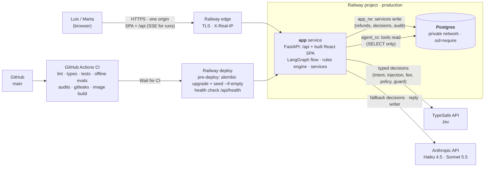

# System design

- **One service, one origin**: FastAPI serves the API and the SPA; no nginx, no CORS.
- **Money moves in one place** (`RefundService`), as `app_rw`; the agent's tools can only read
  (`agent_ro`). The database is reachable only on Railway's private network.
- **Secrets** live in Railway variables; the app never holds the Postgres superuser URL
  (the roles bootstrap runs once from a laptop, `docs/deploy-railway.md`).

## At scale (not built)

The same container on **AWS ECS Fargate** behind an **ALB** and **CloudFront** (caching
`/assets/*`), **RDS for PostgreSQL Multi-AZ**, **Secrets Manager** for the variables,
**CloudWatch** for the JSON logs and alarms, and **Amazon Bedrock** as an alternative
Claude endpoint. The agent would run when each message arrives (a queue of new
conversations) instead of when Luis opens a case.

